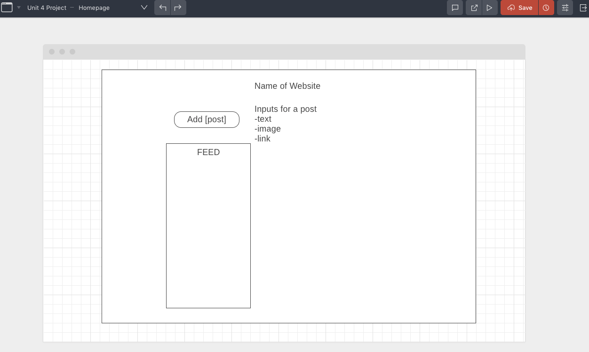

# !FB

Created By: Anna Lornitzo & Sharon Mertens

#### Deployed on Heroku:
[Heroku Backend](https://antifb.herokuapp.com/)

[Heroku Frontend](https://notfb.herokuapp.com/)

#### Github:
[Anna Lornitzo Github](https://github.com/lornitzoa/notfb_frontend)

[Sharon Mertens Github](https://github.com/sharonmertens/notfb_frontend)

This project was bootstrapped with [Create React App](https://github.com/facebook/create-react-app).

This project was built as a way to show full CRUD with react front and backend. You can create a post with text, image, link, and author. There is functionality also to like or dislike posts as well.

* System dependencies
```
  "react": "^16.8.3",
    "react-dom": "^16.8.3",
    "react-scripts": "2.1.5"
```

In the project directory, you can run:

### `npm start`

Runs the app in the development mode.<br>
Open [http://localhost:3000](http://localhost:3000) to view it in the browser.

The page will reload if you make edits.<br>
You will also see any lint errors in the console.

### User Stories:

- As a user I can create an account.
- As a user I can log in.
- As a user I can log out.

- As a user, I can create a post.
- As a user, I can see all posts.
- As a user, I can see an individual post.
- As a user, I can edit/update a post.
- As a user, I can delete a post.
- As a user, I can like a post.
- As a user, I can dislike a post.

### Wireframe:


### Things to continue to work on:
- As a user, I can create a profile to include information.
- As a user, I can edit my profile.
- As a user, I can only dislike or like a post, and once clicked again, it just toggles.

### Resources:
-
-
-
